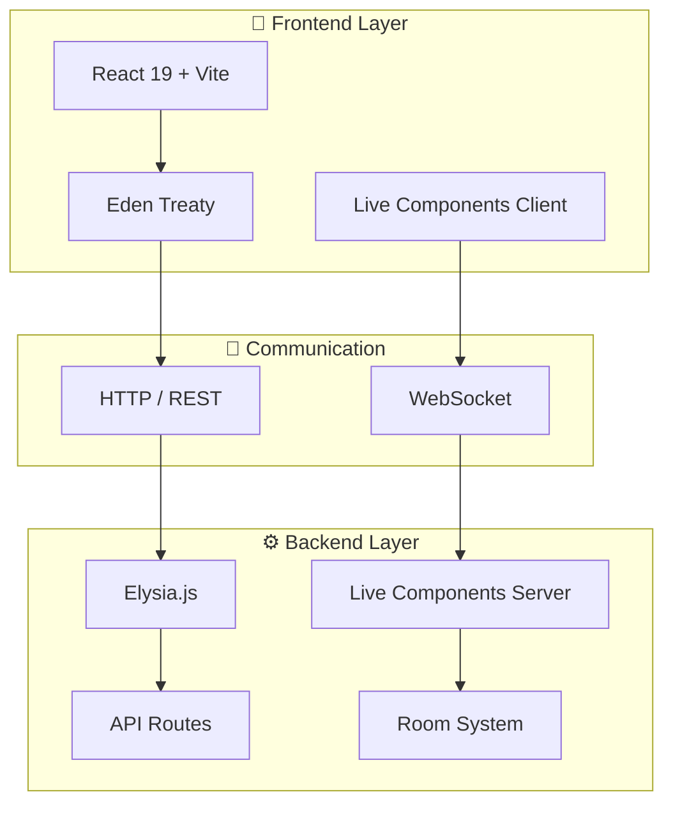

<div align="center">

# ⚡ FluxStack

### The Full-Stack TypeScript Framework for Real-Time Apps

*Build modern web apps with Bun, Elysia, React, and Eden Treaty*

[](https://www.npmjs.com/package/create-fluxstack)
[](https://opensource.org/licenses/MIT)
[](https://bun.sh)
[](https://www.typescriptlang.org/)
[](https://reactjs.org/)

[Quick Start](#-quick-start) • [Features](#-key-features) • [Live Components](#-live-components) • [Documentation](#-documentation--support)

</div>

---

## ✨ Key Features

<table>
<tr>
<td width="50%">

### 🚀 **Blazing Fast**
- **Bun Runtime** - 3x faster than Node.js
- **Elysia.js** - High-performance backend
- **Vite 7** - Lightning-fast HMR

</td>
<td width="50%">

### 🔒 **Type-Safe Everything**
- **Eden Treaty** - Automatic type inference
- **End-to-End Types** - Backend to frontend
- **Zero Manual DTOs** - Types flow naturally

</td>
</tr>
<tr>
<td width="50%">

### ⚡ **Live Components**
- **WebSocket Sync** - Real-time state synchronization
- **Reactive Proxy** - `this.state.count++` auto-syncs
- **Room System** - Multi-room real-time communication

</td>
<td width="50%">

### 🎯 **Production Ready**
- **Docker Multi-Stage** - Optimized containers
- **Declarative Config** - Laravel-inspired config system
- **Plugin Security** - Whitelist-based NPM plugin safety

</td>
</tr>
</table>

---

## 🚀 Quick Start

```bash
# Create a new FluxStack app
bunx create-fluxstack my-awesome-app
cd my-awesome-app
bun run dev
```

**That's it!** Your full-stack app is running:

| Service | URL |
|---------|-----|
| 🌐 **Frontend** | http://localhost:5173 |
| ⚙️ **Backend API** | http://localhost:3000 |
| 📚 **Swagger Docs** | http://localhost:3000/swagger |
| 🩺 **Health Check** | http://localhost:3000/api/health |

### Alternative Installation

```bash
# Create in current directory
mkdir my-app && cd my-app
bunx create-fluxstack .
bun run dev
```

---

## 💎 Tech Stack

<table>
<tr>
<td align="center" width="12.5%">
<br>

<br><b>Runtime</b><br>
<sub>Bun >= 1.2</sub>
<br><br>
</td>
<td align="center" width="12.5%">
<br>

<br><b>Backend</b><br>
<sub>Elysia.js 1.4</sub>
<br><br>
</td>
<td align="center" width="12.5%">
<br>

<br><b>Frontend</b><br>
<sub>React 19</sub>
<br><br>
</td>
<td align="center" width="12.5%">
<br>

<br><b>Build</b><br>
<sub>Vite 7</sub>
<br><br>
</td>
<td align="center" width="12.5%">
<br>

<br><b>Styling</b><br>
<sub>Tailwind CSS 4</sub>
<br><br>
</td>
<td align="center" width="12.5%">
<br>

<br><b>Language</b><br>
<sub>TypeScript 5.8</sub>
<br><br>
</td>
<td align="center" width="12.5%">
<br>

<br><b>API Client</b><br>
<sub>Eden Treaty 1.3</sub>
<br><br>
</td>
<td align="center" width="12.5%">
<br>

<br><b>Testing</b><br>
<sub>Vitest 3</sub>
<br><br>
</td>
</tr>
</table>

---

## 🏗️ Architecture Overview

<div align="center">



</div>

### 📁 Project Structure

<details>
<summary><b>Click to expand directory structure</b></summary>

```bash
FluxStack/
├── 🔒 core/                    # Framework Core (Read-Only)
│   ├── framework/             # FluxStack orchestrator
│   ├── server/                # Elysia plugins, middleware, live engine
│   ├── client/                # Vite integration, Live hooks, providers
│   ├── cli/                   # CLI commands & generators
│   ├── plugins/               # Built-in plugins (Swagger, Vite, etc.)
│   ├── types/                 # Framework type definitions
│   └── utils/                 # Logger, config schema, errors
│
├── 👨‍💻 app/                     # Your Application Code
│   ├── server/                # Backend (Elysia + Bun)
│   │   ├── controllers/       # Business logic
│   │   ├── routes/            # API endpoints + schemas
│   │   ├── live/              # Live Components (server-side)
│   │   └── app.ts             # Elysia app instance (Eden Treaty export)
│   │
│   ├── client/                # Frontend (React + Vite)
│   │   └── src/
│   │       ├── components/    # React components
│   │       ├── pages/         # Route pages
│   │       ├── live/          # Live Components (client-side)
│   │       └── lib/           # Eden Treaty client
│   │
│   └── shared/                # Shared type definitions
│
├── ⚙️ config/                  # Declarative Configuration
│   ├── system/                # Config files (app, server, db, logger, etc.)
│   ├── fluxstack.config.ts    # FluxStack config
│   └── index.ts               # Centralized exports
│
├── 🔌 plugins/                 # Project Plugins (auto-discovered)
├── 🧪 tests/                   # Test suite (unit + integration)
├── 🤖 LLMD/                    # LLM-Optimized Documentation
└── 🐳 Dockerfile               # Multi-stage production build
```

</details>

---

## ⚡ Live Components

Real-time WebSocket components with **automatic state synchronization** between server and client. Define state and logic on the server, interact with it from React — updates sync instantly via WebSocket.

<table>
<tr>
<td width="50%">

### 🖥️ Server Side

```typescript
// app/server/live/LiveCounter.ts
import { LiveComponent } from '@/core/server'

export class LiveCounter extends LiveComponent<{
  count: number
}> {
  static defaultState = { count: 0 }

  async increment() {
    this.state.count++ // auto-syncs via Proxy
    return { success: true }
  }

  async decrement() {
    this.state.count--
    return { success: true }
  }

  async reset() {
    this.state.count = 0
    return { success: true }
  }
}
```

</td>
<td width="50%">

### ⚛️ Client Side

```tsx
// app/client/src/live/CounterDemo.tsx
import { Live } from '@/core/client'
import { LiveCounter } from '@server/live/LiveCounter'

export function CounterDemo() {
  const counter = Live.use(LiveCounter, {
    room: 'global-counter',
    initialState: LiveCounter.defaultState
  })

  return (
    <div>
      <span>{counter.$state.count}</span>

      <button
        onClick={() => counter.increment()}
        disabled={counter.$loading}
      >
        +
      </button>

      <button onClick={() => counter.decrement()}>
        -
      </button>

      <span>
        {counter.$connected ? '🟢' : '🔴'}
      </span>
    </div>
  )
}
```

</td>
</tr>
</table>

### 🔑 Client Proxy API

The `Live.use()` hook returns a Proxy object with full access to server state and actions:

```typescript
const component = Live.use(MyComponent)

// State access
component.$state           // Full state object
component.myProp           // Direct property access via Proxy
component.$connected       // Boolean - WebSocket connected?
component.$loading         // Boolean - action in progress?
component.$error           // Error message or null

// Actions
await component.myAction() // Call server method (type-safe)
component.$set('key', val) // Set a single property

// Form field binding
<input {...component.$field('email', { syncOn: 'change', debounce: 500 })} />
<input {...component.$field('name', { syncOn: 'blur' })} />
await component.$sync()    // Manual sync for deferred fields

// Room events
component.$room.emit('event', data)
component.$room.on('message', handler)
```

### 🏠 Room System

Multi-room real-time communication for Live Components — users in the same room share events.

<table>
<tr>
<td width="50%">

**Server: join rooms and emit events**

```typescript
// app/server/live/ChatRoom.ts
export class ChatRoom extends LiveComponent<State> {

  async joinRoom(payload: { roomId: string }) {
    this.$room(payload.roomId).join()

    this.$room(payload.roomId).on('message:new', (msg) => {
      this.setState({
        messages: [...this.state.messages, msg]
      })
    })

    return { success: true }
  }

  async sendMessage(payload: { text: string }) {
    const message = { id: Date.now(), text: payload.text }
    this.setState({
      messages: [...this.state.messages, message]
    })
    this.$room('chat').emit('message:new', message)
    return { success: true }
  }
}
```

</td>
<td width="50%">

**HTTP API for external integrations**

```bash
# Send a message to a room via API
curl -X POST \
  http://localhost:3000/api/rooms/general/messages \
  -H "Content-Type: application/json" \
  -d '{"user": "Bot", "text": "Hello from API!"}'

# Emit a custom event to a room
curl -X POST \
  http://localhost:3000/api/rooms/tech/emit \
  -H "Content-Type: application/json" \
  -d '{
    "event": "notification",
    "data": {"type": "alert", "msg": "Deploy done!"}
  }'
```

Rooms are accessible both from Live Components (WebSocket) and via REST API for webhooks, bots, and external services.

</td>
</tr>
</table>

---

## 🔒 Type-Safe API Development

**Eden Treaty infers types from Elysia route definitions automatically. No manual DTOs.**

<table>
<tr>
<td width="50%">

### 📝 Define Backend Route

```typescript
// app/server/routes/users.routes.ts
import { Elysia, t } from 'elysia'

export const userRoutes = new Elysia({ prefix: '/users' })
  .post('/', ({ body }) => createUser(body), {
    body: t.Object({
      name: t.String(),
      email: t.String({ format: 'email' })
    }),
    response: t.Object({
      success: t.Boolean(),
      user: t.Optional(t.Object({
        id: t.Number(),
        name: t.String(),
        email: t.String()
      }))
    })
  })
```

</td>
<td width="50%">

### ✨ Use in Frontend (Fully Typed!)

```typescript
// app/client/src/lib/eden-api.ts
import { api } from './eden-api'

// TypeScript knows all types automatically!
const { data, error } = await api.users.post({
  name: 'Ada Lovelace',       // ✅ string
  email: 'ada@example.com'    // ✅ string (email)
})

if (data?.user) {
  console.log(data.user.name)  // ✅ string
  console.log(data.user.id)    // ✅ number
}
```

</td>
</tr>
</table>

**Benefits:**
- ✅ **Zero Manual Types** — Types flow automatically from backend to frontend
- ✅ **Full Autocomplete** — IntelliSense in your IDE
- ✅ **Refactor Friendly** — Change backend schema, frontend updates automatically

---

## ⚙️ Declarative Configuration

Laravel-inspired config system with schema validation and full type inference.

```typescript
// config/system/app.config.ts
import { defineConfig, config } from '@/core/utils/config-schema'

const appConfigSchema = {
  name: config.string('APP_NAME', 'FluxStack', true),
  port: config.number('PORT', 3000, true),
  env: config.enum('NODE_ENV', ['development', 'production', 'test'] as const, 'development', true),
  debug: config.boolean('DEBUG', false),
} as const

export const appConfig = defineConfig(appConfigSchema)
// appConfig.port → number, appConfig.env → "development" | "production" | "test"
```

All environment variables are validated at boot time. See [`.env.example`](.env.example) for available options.

---

## 🔌 Plugin System

Three-layer plugin architecture with security-first design:

| Layer | Location | Auto-discovered | Trusted |
|-------|----------|-----------------|---------|
| 🔒 **Built-in** | `core/plugins/` | No (manual `.use()`) | ✅ Yes |
| 📁 **Project** | `plugins/` | ✅ Yes | ✅ Yes |
| 📦 **NPM** | `node_modules/` | ❌ No (opt-in) | 🔒 Whitelist required |

NPM plugins are **blocked by default**. To add one safely:

```bash
bun run cli plugin:add fluxstack-plugin-auth
# Audits the package, installs it, and adds it to the whitelist
```

---

## 📜 Available Scripts

<table>
<tr>
<td width="50%">

### 🔨 Development

```bash
bun run dev             # Full-stack with hot reload
bun run dev:frontend    # Frontend only (port 5173)
bun run dev:backend     # Backend only (port 3001)
```

</td>
<td width="50%">

### 🚀 Production

```bash
bun run build           # Production build
bun run start           # Start production server
```

</td>
</tr>
<tr>
<td width="50%">

### 🧪 Testing & Quality

```bash
bun run test            # Run tests (Vitest)
bun run test:ui         # Vitest with browser UI
bun run test:coverage   # Coverage report
bun run typecheck:api   # Strict TypeScript check
```

</td>
<td width="50%">

### 🛠️ CLI & Utilities

```bash
bun run cli             # CLI interface
bun run make:component  # Generate a Live Component
bun run sync-version    # Sync version across files
```

</td>
</tr>
</table>

---

## 🔀 Frontend Routes

Default routes included in the demo app (React Router v7):

| Route | Page |
|-------|------|
| `/` | Home |
| `/counter` | Live Counter |
| `/form` | Live Form |
| `/upload` | Live Upload |
| `/api-test` | Eden Treaty Demo |

---

## 🔧 Environment Variables

Copy `.env.example` to `.env` and adjust as needed:

```bash
cp .env.example .env
```

<details>
<summary><b>Key variables</b></summary>

| Variable | Default | Description |
|----------|---------|-------------|
| `PORT` | `3000` | Backend server port |
| `HOST` | `localhost` | Server host |
| `FRONTEND_PORT` | `5173` | Vite dev server port |
| `NODE_ENV` | `development` | Environment |
| `LOG_LEVEL` | `info` | Logging level |
| `CORS_ORIGINS` | `localhost:3000,localhost:5173` | Allowed CORS origins |
| `SWAGGER_ENABLED` | `true` | Enable Swagger UI |
| `SWAGGER_PATH` | `/swagger` | Swagger UI path |

See [`.env.example`](.env.example) for the full list.

</details>

---

## 🐳 Docker

```bash
# Build
docker build -t fluxstack-app .

# Run
docker run -p 3000:3000 fluxstack-app
```

The Dockerfile uses a multi-stage build with `oven/bun:1.2-alpine` and runs as a non-root user.

---

## 🤔 Why FluxStack?

<table>
<tr>
<th>Feature</th>
<th>FluxStack</th>
<th>Next.js</th>
<th>T3 Stack</th>
</tr>
<tr>
<td><b>Runtime</b></td>
<td>✅ Bun (3x faster)</td>
<td>❌ Node.js</td>
<td>❌ Node.js</td>
</tr>
<tr>
<td><b>Backend</b></td>
<td>✅ Elysia (ultra-fast)</td>
<td>⚠️ API Routes</td>
<td>✅ tRPC</td>
</tr>
<tr>
<td><b>Type Safety</b></td>
<td>✅ Eden Treaty (auto)</td>
<td>⚠️ Manual types</td>
<td>✅ tRPC</td>
</tr>
<tr>
<td><b>Real-Time</b></td>
<td>✅ Live Components built-in</td>
<td>⚠️ Third-party</td>
<td>⚠️ Third-party</td>
</tr>
<tr>
<td><b>API Docs</b></td>
<td>✅ Auto-generated Swagger</td>
<td>❌ Manual</td>
<td>❌ Manual</td>
</tr>
<tr>
<td><b>Config System</b></td>
<td>✅ Declarative + validation</td>
<td>⚠️ Manual</td>
<td>⚠️ Manual</td>
</tr>
<tr>
<td><b>Docker</b></td>
<td>✅ Multi-stage ready</td>
<td>⚠️ Manual</td>
<td>⚠️ Manual</td>
</tr>
</table>

---

## ⚙️ Requirements

<table>
<tr>
<td width="50%">

### 📦 System Requirements
- **Bun** >= 1.2.0 (required runtime)
- **Git** (for version control)
- Linux, macOS, or Windows

</td>
<td width="50%">

### 📥 Install Bun

**macOS / Linux:**
```bash
curl -fsSL https://bun.sh/install | bash
```

**Windows:**
```powershell
powershell -c "irm bun.sh/install.ps1 | iex"
```

</td>
</tr>
</table>

> ⚠️ **Important**: FluxStack requires Bun. Node.js is not supported as a runtime.

---

## 📚 Documentation & Support

<table>
<tr>
<td width="33%">

### 📖 Documentation
- [LLMD Index](./LLMD/INDEX.md) — Navigation hub
- [Framework Lifecycle](./LLMD/core/framework-lifecycle.md)
- [Live Components](./LLMD/resources/live-components.md)
- [Live Rooms](./LLMD/resources/live-rooms.md)
- [Routes & Eden Treaty](./LLMD/resources/routes-eden.md)
- [CLI Reference](./LLMD/reference/cli-commands.md)
- [Troubleshooting](./LLMD/reference/troubleshooting.md)

</td>
<td width="33%">

### 💬 Community
- [GitHub Issues](https://github.com/MarcosBrendonDePaula/FluxStack/issues)
- [Discussions](https://github.com/MarcosBrendonDePaula/FluxStack/discussions)
- [Repository](https://github.com/MarcosBrendonDePaula/FluxStack)

</td>
<td width="33%">

### 🔄 Upgrading
```bash
bunx create-fluxstack@latest
```

</td>
</tr>
</table>

---

## 🤝 Contributing

1. Fork the repository
2. Create a feature branch (`git checkout -b feature/my-feature`)
3. Commit your changes (`git commit -m 'Add my feature'`)
4. Push to the branch (`git push origin feature/my-feature`)
5. Open a Pull Request

Please open an [issue](https://github.com/MarcosBrendonDePaula/FluxStack/issues) first to discuss larger changes.

---

## 📄 License

[MIT](LICENSE) - Marcos Brendon De Paula

---

<div align="center">

**Made with ❤️ by the FluxStack Team**

*Star ⭐ this repo if you find it helpful!*

[](https://github.com/MarcosBrendonDePaula/FluxStack)
[](https://www.npmjs.com/package/create-fluxstack)

[Report Bug](https://github.com/MarcosBrendonDePaula/FluxStack/issues) · [Request Feature](https://github.com/MarcosBrendonDePaula/FluxStack/issues) · [Contribute](https://github.com/MarcosBrendonDePaula/FluxStack/pulls)

</div>
